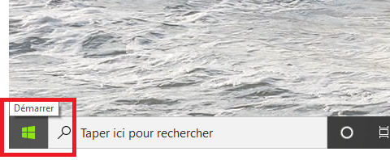
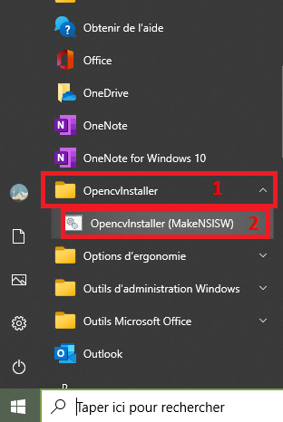

# opencv_installer
auto install of opencv cuda

----------------------------------------------------------------------
## Use Setup

You can use a setup which will install everything for you. You can download it here :
https://drive.google.com/file/d/1-lhDI7VHxrbI013r5Cn8krNPLmjDQ-7c/view?usp=sharing

Then you'll have to go in shortcut by clicking here :

and looking the "O" letter to find a OpencvInstaller folder. Click on it and click on OpencvInstaller (MakeNSISW) as shown here:

I don't find yet how to create a desktop shortcut lol

see for potential issues bellow.

----------------------------------------------------------------------
## Use this github

### required

- Please download this .zip file and unzip it in the >opencv_installer FOLDER< https://drive.google.com/file/d/1v6qdJ5ZdMewfjpZ6rLpz3AB2gNIHNW8W/view?usp=sharing
- Python 3.6 or above ( https://www.python.org/downloads/release/python-365/ )
- Visual studio 19 + C++ ( tutorial : https://docs.microsoft.com/fr-fr/cpp/build/vscpp-step-0-installation?view=msvc-160 )

### How to?

just start install.bat and everything should be good

----------------------------------------------------------------------
## Potential issues

While installing Cuda 10.1 and the 2 upgrades, you should have an issue where it speaks about a process which is not closed. Please wait a bit before try again (it's just a windows issue).
